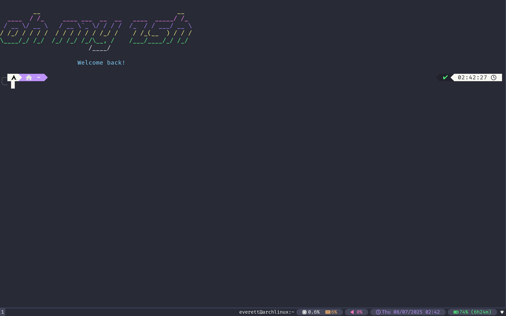

# i3-configs
Configuration files and scripts for i3 and i3blocks intended for Arch Linux systems. Scripts were designed with low power usage as a priority. The appearance adheres to the [Dracula](https://github.com/dracula/dracula-theme) color palette.

## Required Packages (for Arch Linux)

These are the packages needed to run the i3blocks setup and scripts correctly on a fresh Arch Linux install using `archinstall` with i3 selected.

### Core Requirements
These may already be installed if you installed with the `i3` desktop profile:

- `i3-wm` – Window manager
- `i3blocks` – Status bar
- `xorg` – X server
- `xorg-xinit` – X session initializer
- `xorg-xrandr` – Monitor and resolution control
- `xterm` or `alacritty` – Terminal emulator (this setup uses `alacritty`)

### i3blocks Script Dependencies

- `pamixer` – CLI volume control
- `pavucontrol` – Audio mixer GUI
- `htop` – System monitor
- `calcurse` – Terminal-based calendar
- `procps-ng` – Provides `free` and other memory tools
- `coreutils` – Shell utilities (e.g., `date`)
- `bash` – Required for running shell scripts
- `util-linux` – Includes `setsid`, used to launch apps cleanly
- `ttf-font-awesome` – Icon glyphs
- `ttf-nerd-fonts-symbols` or `ttf-nerd-fonts-symbols-mono` – For icons used in i3blocks
- `ttf-firacode-nerd` (or any other font) – Font used by default in i3/config

### Date/Time Utilities

- `coreutils` – Provides `date`
- `tzdata` – Timezone data

### Visual Utilities

- `feh` – Wallpaper setting tool
- `xwallpaper` or `nitrogen` – Alternative wallpaper managers (optional, change in i3/config)

### Optional (Recommended, you will have to change the config if you don't use them)

- `alacritty` – Terminal emulator
- `thunar` – Lightweight file manager
- `flameshot` – Screenshot tool
- `xdg-desktop-portal` – Integration layer for non-DE apps
- `xdg-utils` – For opening URLs and files

### Fonts & Theming

- `ttf-font-awesome` – Icon font
- `ttf-nerd-fonts-symbols` or `ttf-nerd-fonts-symbols-mono` – Extended icons
- `lxappearance` – GTK theme configurator

## License

This project is licensed under the [MIT License](LICENSE).

---
